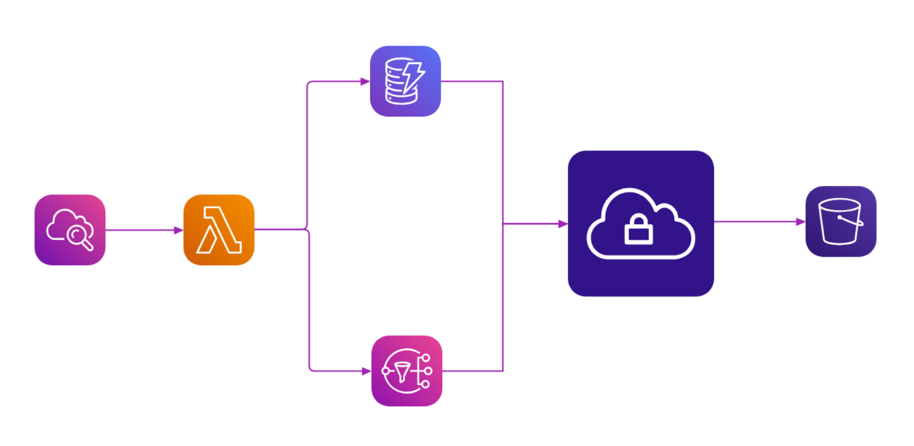

# OSS Markdown Demo Project

> 이 저장소는 Markdown 문법 시연을 위한 예제 프로젝트입니다.\
> GitHub README 작성 방법을 학습하는 것이 목적입니다.

------------------------------------------------------------------------

## 1. 프로젝트 소개 (Introduction)

이 프로젝트는 다음 내용을 학습하기 위해 만들어졌습니다.

-   Markdown 기본 문법 이해
-   GitHub README 작성 방법
-   협업 문서 작성 연습

------------------------------------------------------------------------

## 2. 주요 기능 (Features)

-   텍스트 서식 적용
-   목록 작성
-   코드 블록 사용
-   이미지 삽입
-   표(Table) 작성

------------------------------------------------------------------------

## 3. 설치 방법 (Installation)

다음 명령어를 실행하세요.

``` bash
git clone https://github.com/username/markdown-demo.git
cd markdown-demo
```

------------------------------------------------------------------------

## 4. 사용 예시 (Usage)

프로그램 실행:

``` bash
python app.py
```

출력 예시:

    Hello, Markdown!

------------------------------------------------------------------------

## 5. 이미지 삽입 (Images)

### 외부 이미지


### 내부 이미지 구조

    project/
     ├─ README.md
     └─ diagram.png



------------------------------------------------------------------------

## 6. 표 (Table)

  | 역할 | 이름 | 담당 업무 |
  |------|--------|---------------|
  | 팀장 | 홍길동 | 프로젝트 관리 |
  | 개발 | 김개발 | 기능 구현 |
  | 문서 | 이문서 | README 작성 |

------------------------------------------------------------------------

## 7. 체크리스트 (Task List)

-   [x] README 작성
-   [x] 코드 구현
-   [ ] 테스트 진행
-   [ ] 배포

------------------------------------------------------------------------

## 8. 인용문 (Quote)

> "좋은 문서는 좋은 코드만큼 중요하다."

------------------------------------------------------------------------

## 9. 코드 예시 (Code Example)

``` python
def hello():
    print("Hello, Markdown!")
```

------------------------------------------------------------------------

## 10. 링크 (Links)

-   [GitHub 공식 사이트](https://github.com)
-   [Markdown 문법 가이드](https://www.markdownguide.org)

------------------------------------------------------------------------

## 11. 라이선스 (License)

MIT License
